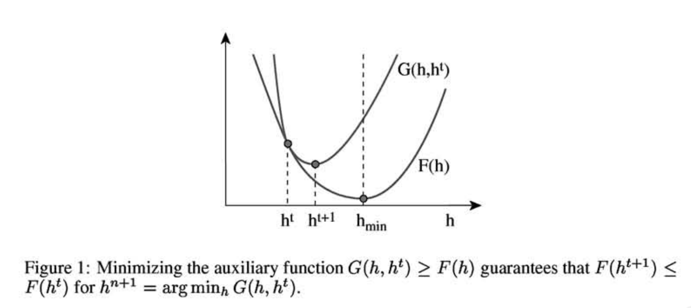

Introduction
------------

[Nonnegative Matrix Factorization
(NMF)](https://www.nature.com/articles/44565) is a technique that tries
to approximate a nonnegative matrix *V* (with
*F* × *N*
 dimensions) into the product of two smaller (also nonnegative) matrices
*W* (
*F* × *K*
) and *H* (
*K* × *N*
).

For those familiar with PCA, NMF is a sort of PCA with nonnegative (and
therefore more easy to interpret by humans) basis. Moreover, these basis
do not need to be orthogonal.

One of my favorite applications of NMF is in recomender systems. If *V*
contains some ratings of users to movies (*F* users and *N* movies), *W*
will contain the atraction of a each user to each topic, and *H* will
contain the amount of each topic in each movie. This decomposition is a
compressed version of the original matrix. Moreover, once we have this
information we can easily guess, by a simple multiplication, the rating
of a user to an unrated movie.

Implementing a NMF algorithm
----------------------------

The first NMF algorithm was derived by [Lee and
Seung](https://papers.nips.cc/paper/1861-algorithms-for-non-negative-matrix-factorization.pdf).
The thing is that, before deriving our NMF algorithm, we have to choose
a distance metric to assess the quality of the approximation

\begin{equation}
V \approx W H
\end{equation}
Lee and Seung considered two cost functions. The Euclidean and the
generalized Kullback-Leiberg (KL), also known as the I-divergence. In
this post we will work with the (generalized) KL divergence. We want to
find the decomposition that minimizes the KL divergence

\begin{equation}
\underset{W,H}{\operatorname{argmin}} D_{KL}(V || WH)
\end{equation}
where the KL divergence is defined as

\begin{equation}
D_{KL}(A || B) = \sum_{ij} \left( A_{ij} \log \frac{A_{ij}}{B_{ij} } - A_{ij}  + B_{ij}\right)
\end{equation}
The idea is to optimize W given H, then H given W and so on until the
algorithm converges. A typical option is Gradient Descent, but
convergence can be slow. Instead, Lee and Seung proposed
Minorize-Maximization (MM) strategy. The idea of MM is to use an
*auxiliary function*. We say that *G*(*h*, *h*′) is an auxiliary
function of *F*(*h*) if *G*(*h*, *h*′) is equal or greater than *F*(*h*)
everywhere and *G*(*h*, *h*)=*F*(*h*). Note that, when the first
parameter is fixed *G*(*h*, *h*′) is a curve. The first parameter tell
us the point where it touches *F*. If we can design such a function, we
can find the *h**m**i**n* at each step and then updating the
curve to *G*(*h**m**i**n*, *h*′) until we reach a minimum.

In our case, *F*(*h*) is a KL divergence. In their paper, Lee and Seung
provide an auxiliary function which can be easily minimized. Doing this
for *W* and *H* we obtain the classic NMF updates:

$$
W_{fk} \leftarrow W_{fk}
\frac
{\sum_n H_{kn} \frac{V_{fn}}{[WH]_{fn}}}
{\sum_n H_{kn}},
\qquad 
H_{kn} \leftarrow H_{kn} 
\frac{\sum_f W_{fk} \frac{V_{fn}}{[WH]_{fn}}}
{\sum_f W_{fk}}
$$

Recall that the updates are supposed to minimize the KL divergence
between the approximation and the true matrix. To monitorize this, let
us code a function that computes the KL divergence:

    #' @title Compute the KL divergence 
    #' @param A first matrix
    #' @param B second matrix
    #' @details This function is useful for debugging
    KL_divergence_Lee <- function(A, B){
      I <- dim(V)[1]
      J <- dim(V)[2]
      total <- 0
      for(i in 1:I){
        for(j in 1:J){
          if (A[i,j] == 0) next
          if ((B[i,j]) == 0 && (A[i,j] > 0)) return(Inf)
          total <- total + A[i,j]*log(A[i,j]/B[i,j]) - A[i,j] + B[i,j]
        }
      }
      total
    }

Now we can write the algorithm, which iteratively updates *W* and *H*
until convergence:

    #' @title NMF with Lee and Saung multiplicative updates
    #' @param V matrix to factorize
    #' @param K number of latent factors (or dimensions)
    #' @param W initial W matrix
    #' @param H initial H matrix
    #' @param maxiters maximum number of iterations
    #' @details The number of iterations is set to maxiters.
    nmf_Lee <- function(V, K, W, H, maxiters = 100){
      F <- nrow(V)
      N <- ncol(V)
      
      KLlog <- rep(NA, maxiters)
      for (i in 1:maxiters){
        cat("\n iteration:", i, "/", maxiters)
        
        # update H
        for(k in 1:K){
          denominator <- sum(W[,k])
          for(n in 1:N){
            numerator <- sum(W[,k]*V[,n]/(W%*%H[,n]), na.rm = TRUE)
            if(denominator == 0) stop("W matrix with zero-sum column")
            H[k,n] <- H[k,n] * numerator/denominator
          }
        }
        
        # update W
        for(k in 1:K){
          denominator <- sum(H[k,])
          for(f in 1:F){
              numerator <- sum(H[k,] * V[f,]/(W[f,]%*%H), na.rm = TRUE)
              if(denominator == 0) stop("H matrix with zero-sum column")
              W[f,k] <- W[f,k] * numerator/denominator
          }
        }
        KLlog[[i]] <- KL_divergence_Lee(V, W%*%H)
      }
      list(W=W, H=H, KLlog = KLlog)
    }

Faces dataset
-------------

To play with our code, let us download the ATT Faces dataset. The
dataset consists of 10 black and white photos of each member of a group
40 individuals. 400 images in total.

    library(pixmap)

    url <- "http://www.cl.cam.ac.uk/Research/DTG/attarchive/pub/data/att_faces.zip"
    filename <- basename(url)
    download.file(url = url, destfile = filename)
    unzip(filename, exdir = "faces")
    dirname <- './faces/'
    dirs <- list.dirs("./faces")
    files <- list.files(pattern = ".pgm", recursive = TRUE)
    V <- matrix(nrow = 92*112, ncol = length(files))
    for (i in 1:length(files)){
      v <- read.pnm(file = files[i], cellres=1)
      V[,i] <- floor(as.vector(v@grey)*255)
    }

    #'@title Plot a face
    #'@details Given a vectorized image, reconstruct its matrix and plot it
    plot_face <- function(arr10304){
      m <- matrix(arr10304, ncol=92,  nrow = 112)
      image(t(m[112:1,]), asp=112/92, axes = FALSE, col=gray(0:255/255))
    }

    # Plot some faces
    par(mfrow=c(2,3), mar=c(0,0,0,0), oma=c(0,0,0,0), oma=c(12,0,0,0))
    for(i in sample(400,6)){
      plot_face(V[,i])
    }

Now we call our NMF algorithm using this dataset as input. Let say we
want to use *K=10* latent dimensions, or dictionary basis.

	F <- nrow(V)
	N <- ncol(V)
	K = 10
	W <- matrix(rpois(n = F*K, lambda = 10), nrow = F, ncol = K) 
	H <- matrix(rpois(n = N*K, lambda = 10), nrow = K, ncol = N) 
	res <- nmf_Lee(V, K, W, H, maxiters = 200))

Did the algorithm convergence? The KL divergence is improving slowly
after 200 iterations, so we will stop here.

    plot(res$KLlog, type='l', ylab= "KL divergence", xlab = "iteration")

Let's see how does our dictionary look like, and let's compare with the
dictionary of a PCA:

    # PCA 
    pca   <- prcomp(V)
    V_hat_pca  <- pca$x[,1:K] %*% t(pca$rotation[,1:K])

    # Plot some faces and their reconstructions
    par(mfcol=c(2,10), mar=c(0,0,0,0), oma=c(0,0,0,0), oma=c(12,0,0,0))
    for(k in 1:K){
      plot_face(res$W[,k])
      plot_face(pca$x[,k])
    }

Finally, let's see how good the reconstruction is, and let us compare
with a PCA:

    # PCA
    mu    <- colMeans(V)
    pca   <- prcomp(V)
    Kpca <- 10
    V_hat_pca  <- pca$x[,1:Kpca] %*% t(pca$rotation[,1:Kpca])
    V_hat_pca  <- scale(V_hat_pca, center = -mu, scale = FALSE)

    # NMF reconstruction
    V_hat <- res$W %*% res$H

    # Plot some faces and their reconstructions
    par(mfcol=c(3,10), mar=c(0,0,0,0), oma=c(0,0,0,0), oma=c(12,0,0,0))
    for(i in sample(ncol(V),10)){
      plot_face(V[,i])
      plot_face(V_hat[,i])
      plot_face(V_hat_pca[,i])
    }

Note that the quality of our reconstruction depends on the chosen number
of latent dimensions or components *K* (the larger, the more expressive
our dictionary basis), the convergence (we can try a bunch more of
iterations) and the quality of the model to the data (KL is appropiate
for Poisson data, PCA for Gaussian data).

Final remarks
-------------

The algorithm presented in this post was the one who triggered the
interested in NMF in 1999. However, the story continued for the next
years and until today, taking different research avenues.

In one of these avenues researchers proposed NMF algorithms to minimize
other cost functions and assuming other likelihoods beyond Poisson and
Gaussian. In another one, someone realized that there are some
conections between some cost functions and some likelihoods: for
instance, the KL minimization in this post is equivalent to find the MLE
estimator assuming our data come from a Poisson distribution with mean
*W**H*.

In another avenue, people consider W and H as random latent variables,
and instead of trying to find point extimators for *W*, *H* they infer a
posterior distribution over each of them.

Finally, scalability is another important issue nowadays: people are
playing with optimization algorithms that use a subsample of the data at
each iteration (Stochastic Gradient Descent, Stochastic Variational
Inference,...) so that iterations are computationally cheaper while
keeping good convergence properties in terms of number of iterations.
